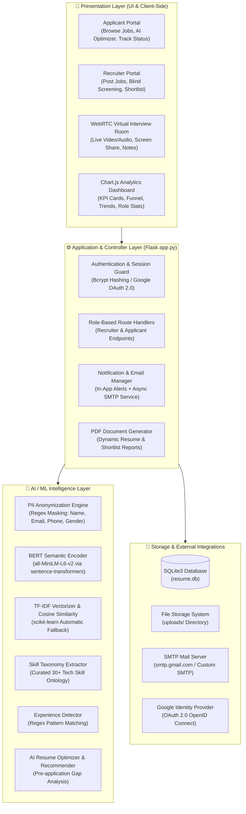
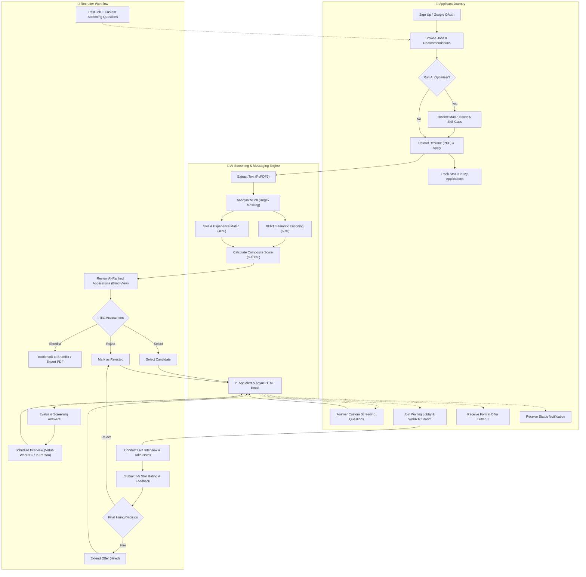
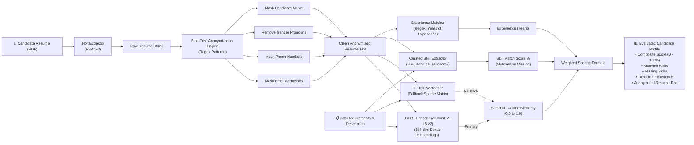

# 🎯 AI Resume Screening & Interview Management System

An intelligent, end-to-end recruitment platform that leverages **NLP and Machine Learning** to automate resume screening, eliminate hiring bias, and streamline the entire interview pipeline — from job posting to final hire.


---

## ✨ Key Features

### 🤖 AI-Powered Resume Analysis
- **BERT Semantic Matching** (`all-MiniLM-L6-v2` via `sentence-transformers`) for deep, context-aware resume-to-job matching
- **TF-IDF + Cosine Similarity** retained as automatic fallback if BERT is unavailable
- **Automated Skill Extraction** against a curated skills database
- **Experience Detection** using regex pattern matching
- **Weighted Scoring** (60% BERT semantic similarity + 40% keyword match)

### 🔒 Bias-Free Screening
- **Resume Anonymization Engine** removes names, emails, phone numbers, and gender-specific words using Regex
- Recruiters evaluate candidates purely on skills and experience

### 📊 Analytics Dashboard
- **6 KPI Cards** — Open Positions, Total Candidates, Hires Made, Offer Acceptance Rate, Avg Time to Hire, Interview Pass Rate
- **Hiring Pipeline Funnel** — Visual progression from Applied → Screened → Interviewed → Offered → Hired with conversion rates
- **Hiring Trends Chart** — Interactive Chart.js line graph showing applications & hires over 6 months
- **Role-Based Stats Table** — Per-job breakdown with fill rate progress bars
- **Tasks & Alerts Widget** — Interviews today, pending feedback, offers awaiting decision, stuck candidates (7+ days)
- **Time Period Filtering** — All Time / Last Month / Last Quarter / Last Year with AJAX updates

### 🎥 Virtual Interview Room
- **Live Camera & Microphone** access via WebRTC APIs
- **Screen Sharing** capability
- **Interview Timer** with auto-expiry (5-hour window)
- **Side Panel** with interview questions checklist, live chat, and notes
- **Star Rating & Feedback** submission post-interview

### 📋 Full Recruitment Pipeline
```
Pending → Selected → Questions Answered → Interview Scheduled → Interviewed → Hired / Rejected
```
- Custom screening questions per job
- **Virtual or In-Person interviews** — recruiters choose the type when scheduling
- In-person interviews include **location/address** and **additional instructions** (dress code, documents to carry)
- Interview scheduling with date/time picker
- Interview rescheduling with automatic notifications
- One-click hire/reject with candidate notifications

### 🔔 Real-Time Notification System
- Automated alerts for both recruiters and applicants
- Notification badges with unread count
- Delete individual or all notifications
- Triggers on: selection, rejection, interview scheduling, rescheduling, feedback, and hiring

### 📧 Email Integration
- **SMTP-based email delivery** at every pipeline stage (selection, rejection, interview scheduling, rescheduling, feedback, hiring)
- **Branded HTML email templates** with responsive design
- **Async sending** via background threads (non-blocking)
- **Configurable** via environment variables (Gmail, Outlook, custom SMTP)
- **Opt-in by default** — set `EMAIL_ENABLED=true` to activate

### 💡 AI Resume Optimizer & Recommendations
- **Pre-Application Scoring**: Applicants can test their resume against job descriptions using BERT before officially submitting
- **Skill Gap Analysis**: Identifies missing critical skills and provides targeted suggestions to enhance resume competitiveness
- **Job Recommendation Engine**: Automatically computes affinity scores against all active listings to surface the best-fit opportunities

### 📌 Recruiter Shortlist & PDF Reports
- **Candidate Bookmarking**: Star and organize promising candidates into a centralized shortlist
- **Private Evaluation Notes**: Recruiters can record interview impressions and internal evaluation notes per applicant
- **Exportable PDF Summaries**: Generate standardized PDF candidate profiles and shortlist summaries directly via FPDF

### 🔐 Google OAuth Login
- **"Continue with Google"** for both recruiters and applicants
- Automatic account creation on first Google sign-in
- Uses Google email as username for seamless integration
- Configured via `.env` file (Client ID & Client Secret)

### 🗑️ Account Management
- **Delete Account** option in both recruiter and applicant dashboards
- Cascading deletion — removes all jobs, applications, interviews, notifications, and user data
- Confirmation dialog to prevent accidental deletion

---

## 🏛️ System & Workflow Architecture

### 1. High-Level System Architecture
The platform is engineered using a modular 4-tier architecture comprising Presentation, Application Routing, AI/NLP Screening, and Persistence layers:



---

### 2. End-to-End Recruitment Workflow
The hiring lifecycle moves candidates through an automated, fair, and transparent pipeline from vacancy creation to final offer:



---

### 3. AI Screening & Scoring Pipeline Breakdown
The AI screening engine eliminates human cognitive bias and evaluates candidate-job fit using contextual natural language processing:



#### Mathematical Scoring Model
The system balances deep contextual semantic understanding with explicit skill verification:

$$\text{Composite Match Score} = (\text{Semantic Similarity} \times 60) + (\text{Skill Coverage } \% \times 0.40)$$

- **Semantic Similarity ($60\%$)**: Generated via cosine similarity over 384-dimensional sentence transformer embeddings (`all-MiniLM-L6-v2`), understanding conceptual synonyms (e.g., "REST API development" matches "FastAPI microservices"). Falls back to scikit-learn's TF-IDF cosine metric if BERT is unavailable.
- **Skill Coverage ($40\%$)**: Evaluates the intersection between required job competencies and candidate proficiency across 30+ pre-indexed technical domains.
- **Experience Match**: Automatically extracts years of experience to assist recruiters during evaluations.

---

### 4. Recruitment Pipeline State Machine & Lifecycle Transitions

| Pipeline State | Trigger Action | Actor | Backend Operations | In-App Alert | Async HTML Email |
|:---|:---|:---|:---|:---:|:---:|
| `pending` | Candidate submits application & resume | Applicant | • Parses PDF & masks PII<br/>• Computes BERT & skill score<br/>• Enters ranked leaderboard | Recruiter | — |
| `shortlisted` | Candidate bookmarked for priority review | Recruiter | • Records application in `shortlist` table<br/>• Stores recruiter notes<br/>• Ready for PDF batch export | — | — |
| `selected` | Candidate passes initial resume screen | Recruiter | • Unlocks custom screening questions<br/>• Advances status to `selected` | Applicant | `send_selection_email()` |
| `questions_answered`| Candidate answers screening questions | Applicant | • Stores answers in `interview_responses`<br/>• Displays submission to recruiter | Recruiter | `send_questions_answered_email()` |
| `interview_scheduled`| Recruiter sets date, time, and format | Recruiter | • Generates unique WebRTC `room_id` (Virtual)<br/>• Records venue & dress code (In-Person) | Applicant | `send_interview_scheduled_email()` |
| `interview_rescheduled`| Recruiter updates interview time slot | Recruiter | • Updates schedule and recalculates room window | Applicant | `send_interview_rescheduled_email()` |
| `interviewed` | Recruiter completes live interview | Recruiter | • Logs 1-5 star rating and internal notes<br/>• Unlocks final hiring decision buttons | Applicant | `send_interview_completed_email()` |
| `hired` | Recruiter extends formal job offer | Recruiter | • Updates application to `hired`<br/>• Updates dashboard KPIs & hiring funnel | Applicant | `send_hired_email()` |
| `rejected` | Recruiter marks candidate as unsuitable | Recruiter | • Updates application to `rejected`<br/>• Updates funnel conversion metrics | Applicant | `send_rejection_email()` |

---

## 🛠️ Tech Stack

| Layer | Technology |
|-------|-----------|
| **Backend** | Python, Flask |
| **Database** | SQLite3 |
| **AI/ML** | BERT (`sentence-transformers`, `all-MiniLM-L6-v2`), scikit-learn (TF-IDF fallback) |
| **Frontend** | HTML5, CSS3, JavaScript, Jinja2 |
| **Charts** | Chart.js 4.x |
| **Video/Audio** | WebRTC (MediaDevices & Screen Capture APIs) |
| **Security** | bcrypt (password hashing) |
| **OAuth** | Authlib (Google OAuth 2.0) |
| **File Parsing** | PyPDF2 (PDF extraction) |
| **PDF Generation** | FPDF (fpdf2) |
| **Email** | SMTP (smtplib), HTML templates |
| **Config** | python-dotenv (.env files) |

---

## 🚀 Getting Started

### Prerequisites
- Python 3.9+
- pip

### Installation

1. **Clone the repository**
   ```bash
   git clone https://github.com/surajsharma-ai/Resume-Screening-System.git
   cd Resume-Screening-System
   ```

2. **Create a virtual environment**
   ```bash
   python -m venv venv
   source venv/bin/activate    # Linux/Mac
   venv\Scripts\activate       # Windows
   ```

3. **Install dependencies**
   ```bash
   pip install flask bcrypt scikit-learn PyPDF2 fpdf2 authlib requests python-dotenv sentence-transformers
   ```
   > **Note**: `sentence-transformers` will automatically download the BERT model (~90MB) on first run and cache it locally.

4. **Run the application**
   ```bash
   python app.py
   ```

5. **Open in browser**
   ```
   http://127.0.0.1:5000
   ```

### Environment Variables Setup
Create a `.env` file in the project root:
```env
# Google OAuth (get from https://console.cloud.google.com)
GOOGLE_CLIENT_ID=your-google-client-id
GOOGLE_CLIENT_SECRET=your-google-client-secret

# Email Service - Gmail App Password (https://support.google.com/accounts/answer/185833)
SMTP_USERNAME=your-email@gmail.com
SMTP_PASSWORD=your-16-char-app-password
```
> **Gmail users**: Use an [App Password](https://support.google.com/accounts/answer/185833), not your regular password.

### Quick Demo Setup (Optional)
Seed sample data with a demo recruiter account:
```bash
python seed_demo.py
```
Login with: **Username:** `demo_recruiter` | **Password:** `password`

---

## 📁 Project Structure

```
Resume-Screening-System/
├── app.py                      # Main Flask application (all routes & logic)
├── email_service.py            # SMTP email service with HTML templates
├── seed_demo.py                # Demo data seeder script
├── data/
│   └── resume.db               # SQLite database (auto-created)
├── uploads/                    # Uploaded resume files
├── static/
│   └── style.css               # Complete stylesheet
├── templates/
│   ├── landing.html            # Home page
│   ├── recruiter_login.html    # Recruiter authentication
│   ├── recruiter_register.html
│   ├── recruiter_dashboard.html # Analytics dashboard
│   ├── post_job.html           # Job posting form
│   ├── view_applications.html  # Application review & ranking
│   ├── interview_questions.html # Screening questions manager
│   ├── interview_room.html     # Virtual interview room (WebRTC)
│   ├── interview_waiting.html  # Pre-interview lobby
│   ├── applicant_login.html    # Applicant authentication
│   ├── applicant_register.html
│   ├── applicant_dashboard.html
│   ├── browse_jobs.html        # Job listings feed
│   ├── apply_job.html          # Resume upload & results
│   ├── my_applications.html    # Application status tracker
│   ├── answer_questions.html   # Screening question responses
│   └── notifications.html      # Notification center
├── .env                        # Environment variables (secrets — not committed)
├── .gitignore
```

---

## 📸 Screenshots

### Analytics Dashboard
KPI cards, hiring pipeline funnel, trend charts, role stats, and alerts — all with time-period filtering.

### AI Resume Scoring
TF-IDF powered matching with skill breakdown, anonymized text preview, and experience extraction.

### Virtual Interview Room
Live camera, screen sharing, interview timer, questions checklist, and post-interview feedback.

---

## 🗃️ Database Schema

| Table | Purpose |
|-------|---------|
| `users` | Stores recruiters & applicants with bcrypt-hashed passwords |
| `jobs` | Job postings with descriptions, skills, and salary |
| `applications` | Resume data, match scores, and pipeline status |
| `interview_questions` | Custom screening questions per job |
| `interview_responses` | Applicant answers to screening questions |
| `interviews` | Scheduled interviews with room IDs and feedback |
| `notifications` | Real-time alerts for both user roles |

---

## 🔮 Future Scope

- **Transformer Models** (BERT/GPT) for deeper semantic resume understanding ✅ *Done — now using `all-MiniLM-L6-v2`*
- **Real-time Emotion Detection** during video interviews
- **SMS/Email Integration** via Twilio/SendGrid
- **LinkedIn Profile Verification** for resume claim validation
- **HR System Export** (Workday/SAP integration)

---

## 👨‍💻 Author

**Sooraj Sharma** — [GitHub](https://github.com/surajsharma-ai)

---

## 📄 License

This project is for educational purposes (Final Year Project).
